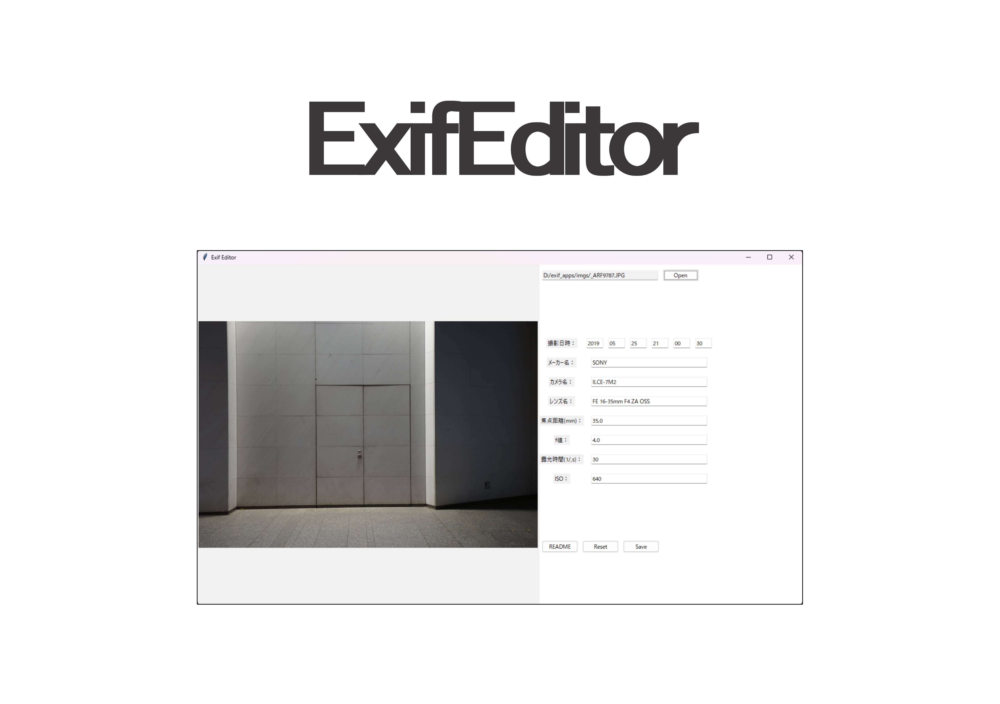

<h1 align="center"></h1>

-------

## Description

You can use ExifEditor to edit Exif information of image file.

Japanese version of README.md can be found in [./docs/ja/README.md](./docs/ja/README.md).

## Features

ExifEditor is a graphical tool for editing Exif information of image file.
You can use this application to read and write Exif information attached to image files. The application also allows you to create new Exif information.
Only image files with .jpg or .tiff extension are accepted.

Editable Exif information is limited to the following items:

- date and time of shooting
- maker name
- camera model
- lens model
- focal length
- f-number
- exposure time
- ISO

## System requipments

- Windows 10 64-bit or later

(We have not confirmed execution on environments other than those listed above, such as MacOS, so please do so at your own risk.)

## Development enviroment

Python environment and libraries used are listed below.

- Python 3.8 or later
- tkinter
- PIL
- piexif

## How to build standalone executable

You can easily build a standalone executable by using pyinstaller:

```bash
# install pyinstaller (if Anaconda, you should use conda.)
pip install pyinstaller
# build by using pyinstaller
pyinstaller exif_editor.py --onefile --noconsole --exclude pandas --exclude numpy
```

### postscript

ExifEditor currently available is an initial version.
Please contact me for any problems or improvements.
I plan to add or implement additional functions as needed...
